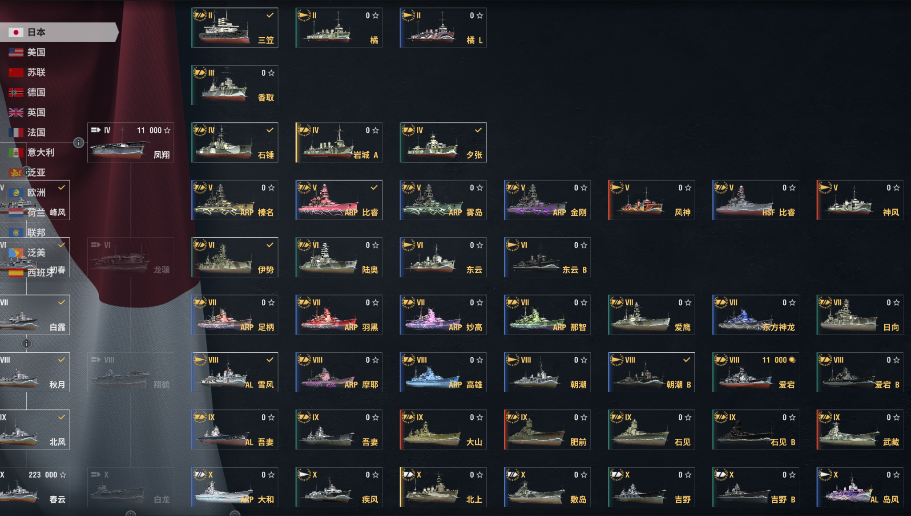

# 战舰世界简体中文船译名勘误

《战舰世界》(World of Warships) 简体中文舰船译名勘误项目。从 [wgmods/ModSDK](https://github.com/wgmods/ModSDK) 同步官方翻译，供人工校对修正。

## Mod 介绍

《战舰世界》现有两个简体中文翻译版本——国服（360服）使用的 `zh` 和国际服（wg服）使用的 `zh-sg`，两边的翻译有很多不同，同时也有很多错误，尤其是国服还会对泛亚及日本舰船进行和谐，如果使用反和谐 mod 也只是简单的替换为国际服文本，反而导致了许多错误，本 mod 用于修正这些翻译错误。

### 修改内容

Mod 只对船名进修了修改，未对其他文本，如舰船介绍中出现的文本进行修改，另外由于军械库（兵工厂）等内容实际为网页，也无法修改。

Mod 有四种文件以供下载：

| 后缀     | 含义                                                                          |
| -------- | ----------------------------------------------------------------------------- |
| full     | 修正后船名均使用全名                                                          |
| standard | 修正后船名均按照英文进行部分缩写                                              |
| global   | 以国际服为基础替换全部翻译，会与其他任何修改了翻译的 mod 冲突                 |
| inc      | 仅修正错误的翻译，国服其他的翻译会保持不变，只会与修改了同一条文本的 mod 冲突 |

**注意**：inc 版本的 mod 需要手动安装 [AndrewTaro/LocalizationLoader](https://github.com/AndrewTaro/LocalizationLoader)

示例：

| 国服     | 国际服          | full              | standard   |
| -------- | --------------- | ----------------- | ---------- |
| 富兰克林 | 富兰克林·罗斯福 | 富兰克林·D·罗斯福 | F·D·罗斯福 |
| 依阿华   | 依阿华          | 衣阿华            | 衣阿华     |
| 鲸       | 大和            | 大和              | 大和       |
| ARP鲸    | ARP Yamato      | ARP 大和          | ARP 大和   |
| 敏锐     | 佐尔基          | 敏锐              | 敏锐       |

### 示例图片

使用了**科技树增强 Another** 以更好的展示效果

国际服：

修改后：

### 下载安装

下载位置：[release](https://github.com/XYY1411/wows-zh-shipname-fixes/releases/)

下载所需的文件解压并覆盖到游戏安装目录 `World_of_Warships\bin\<版本号>\` 下的同名文件夹即可

## 项目介绍

### 做什么

- **自动同步**：每天检查 ModSDK 新版本，拉取 zh / zh_sg / en 翻译，按版本归档
- **生成表格**：`global.xlsx` 对照表、`ship.xlsm` 舰船词条（含 VB 宏配色）
- **版本差异 + 翻译迁移**：自动对比上一版本、迁移已填最终翻译
- **构建发布**：`build_release.py` 生成编译的翻译文件
- **打包发布**：`package_release.py` / 手动工作流打包为 `res_mods/texts` zip 并发布

### 去哪找文件

| 内容                   | 位置                                                       |
| ---------------------- | ---------------------------------------------------------- |
| 翻译与表格             | `translations/<版本号>/`                                   |
| 三语言对照表           | `translations/<版本号>/global.xlsx`                        |
| 舰船词条表（翻译入口） | `translations/<版本号>/ship.xlsm`                          |
| 版本差异表             | `translations/<版本号>/global_diff.xlsx`、`ship_diff.xlsx` |
| 原始键值数据           | `translations/<版本号>/<语言>/global.csv`、`ship.csv`      |
| 发布脚本               | `scripts/build_release.py`、`package_release.py`           |

### 怎么用

- **看/填翻译**：打开 `translations/<版本号>/ship.xlsm`，在「最终翻译」列填写译名
- **构建发布**：`py -3 scripts/build_release.py [版本号]`，使用选项 `--release` 来更新热修复版本
- **打包**：`py -3 scripts/package_release.py [版本号]`
- **发布**：GitHub Actions 手动运行 _打包并发布 Mod_

### 文档

- [目录结构](docs/structure.md)
- [工作流](docs/workflow.md)
- [表格与差异](docs/tables.md)
- [翻译流程](docs/translation.md)
- [发布构建](docs/release.md)

### 感谢 · 许可

- 感谢 & 参考
    - [战舰世界全系舰名翻译勘误](https://www.bilibili.com/opus/1234142123653070865) by Mrtn
    - [战舰世界国服与外服舰名差异锐评](https://www.bilibili.com/opus/1152524855843749906) by Mrtn
    - [维基百科](https://www.wikipedia.org/)
    - 译名室, 新华通讯社. 世界人名翻译大辞典（第二版）[M]. 北京: 中国对外翻译出版公司, 2007. ISBN 9787500107996. OCLC 163575075
    - 周定国. 世界地名翻译大辞典[M]. 北京: 中国对外翻译出版公司, 2008. ISBN 9787500107538
- 翻译数据源自 [wgmods/ModSDK](https://github.com/wgmods/ModSDK)，版权归 © 2012–2026 Wargaming.net，仅作非商业勘误
- 本项目修正翻译/脚本/文档采用 CC BY-NC-SA 4.0；与 Wargaming.net 无官方关联
- 详见 [LICENSE](LICENSE)
